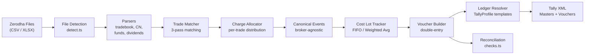
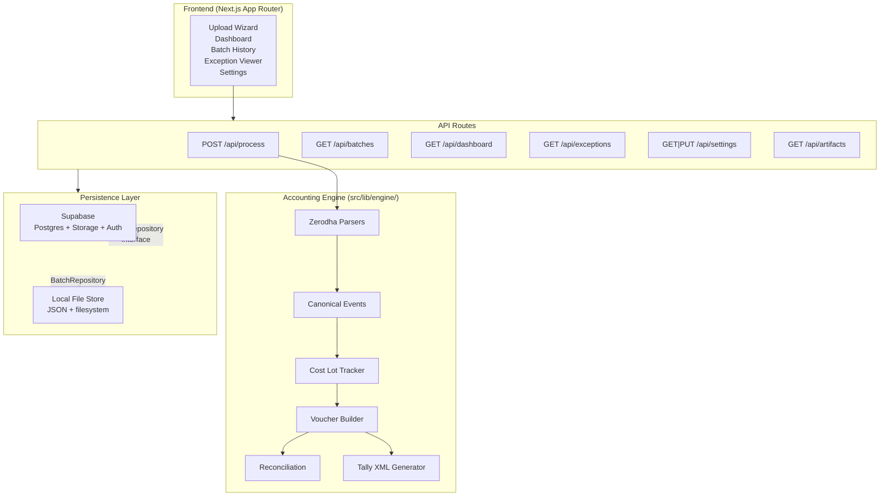
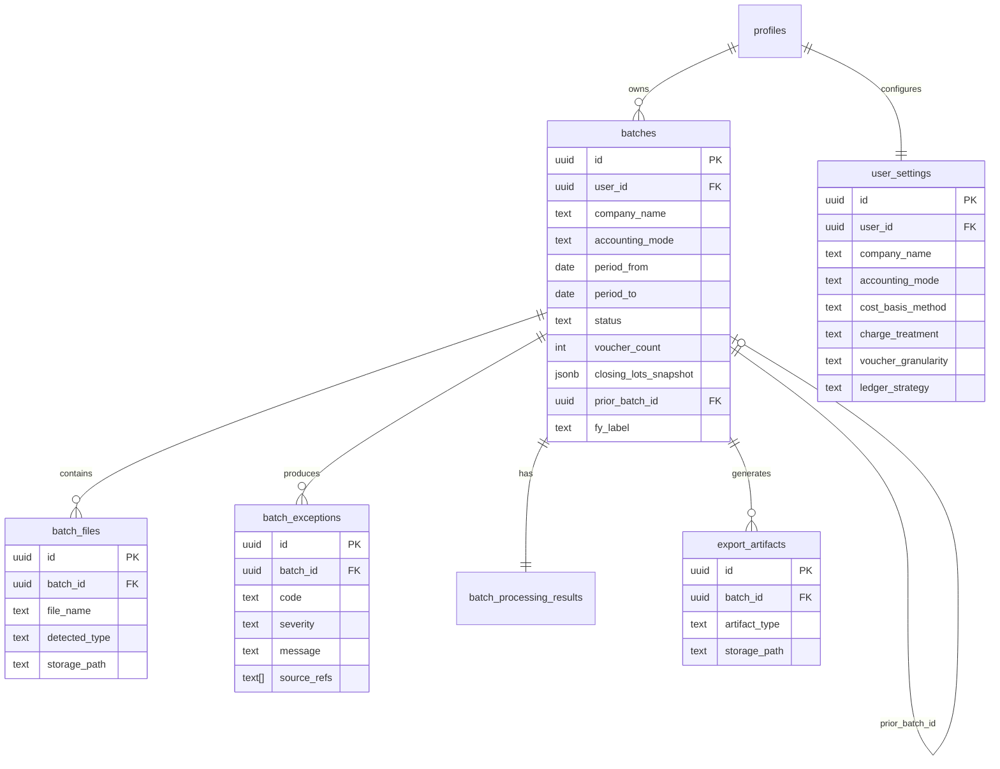

# TradebooksAI

**Broker-to-Tally accounting automation for Indian investors and CAs.**

Convert Zerodha broker exports (tradebook, contract notes, funds statement, dividends) into Tally-importable XML with double-entry vouchers, cost lot tracking, STCG/LTCG classification, and full reconciliation — in minutes instead of weeks.

---

## Table of Contents

- [The Problem](#the-problem)
- [Features](#features)
- [Tech Stack](#tech-stack)
- [Architecture](#architecture)
- [Project Structure](#project-structure)
- [How It Works](#how-it-works)
- [Accounting Engine Decisions](#accounting-engine-decisions)
- [Getting Started](#getting-started)
- [Testing](#testing)
- [CI/CD](#cicd)
- [Architecture Decision Records](#architecture-decision-records)
- [Supported File Types](#supported-file-types)
- [Event Types Reference](#event-types-reference)

---

## The Problem

Indian Chartered Accountants and investors filing ITR-2 (capital gains) or ITR-3 (business income) need to import broker trade data into Tally ERP for statutory compliance and audit readiness.

**The current workflow is entirely manual:**

1. Download multiple Zerodha reports — tradebook, contract notes, funds statement, dividends, holdings
2. Create journal entries for every trade (buy, sell, charges, dividends)
3. Track cost lots per security to compute FIFO-based cost of acquisition
4. Classify each sale as STCG or LTCG based on holding period from the specific lot's acquisition date
5. Handle dividend income with TDS deduction entries
6. Reconcile charges across tradebook and contract notes
7. Create Tally ledger masters for every security, charge type, and gain/loss category

For a typical retail investor with 200+ trades across 4 financial years, this is **2-3 weeks of manual bookkeeping per client**.

**TradebooksAI automates the full pipeline:** upload Zerodha files, get Tally-ready XML with all journal entries, ledger masters, cost basis tracking, gain classification, and reconciliation checks. Import into Tally in minutes.

---

## Features

| Feature | What it does |
|---|---|
| **Multi-format parsing** | Tradebook CSV, Contract Notes XLSX, Funds Statement, Dividends, Holdings, Tax P&L, AGTS — auto-detected from column-header fingerprinting |
| **Trade-to-CN matching** | 3-pass matching (EXACT trade_no, HIGH order+qty+date, APPROXIMATE with price tolerance) between tradebook and contract note rows |
| **Charge allocation** | Distributes aggregate contract note charges to individual trades: brokerage per-unit, all others proportional by trade value |
| **FIFO cost lot tracking** | Per-security lot queues with corporate action adjustments (bonus, split, merger) and JSON serialization for multi-FY carryforward |
| **STCG/LTCG classification** | Automatic gain type from lot-level holding period: 0 days = speculation, 1-365 = short-term, >365 = long-term |
| **Investor and Trader modes** | Capital Account (ITR-2) with charge capitalization vs. P&L/stock-in-trade (ITR-3) with charges expensed |
| **Per-scrip ledgers** | Individual Tally ledgers per security (e.g. `RELIANCE-SH`, `STCG ON RELIANCE`) driven by TallyProfile templates |
| **Double-entry vouchers** | Journal, Purchase, Sales, Receipt, Payment, Contra — with hard DR=CR balancing (throws on imbalance) |
| **Tally XML export** | TallyPrime-compatible Masters + Transactions XML with correct sign conventions and date formatting |
| **Reconciliation checks** | Trade totals, voucher balance, CN charge completeness, holdings verification, duplicate detection, TDS validation |
| **Multi-FY support** | Closing lot snapshots persisted per batch; `prior_batch_id` linkage for continuous FIFO across financial years |
| **Dividend + TDS** | 3-legged journal: DR Bank (net), DR TDS on Dividend (TDS amount), CR Dividend Income (gross) |
| **Corporate actions** | Bonus shares (zero-cost lot), stock splits (qty/cost adjustment), mergers (lot transfer), rights issues (additional cost) |
| **Supabase + local fallback** | Repository pattern: Supabase (auth + Postgres + storage) in prod, local JSON files in dev — switchable by env var |

---

## Tech Stack

| Layer | Technology |
|---|---|
| Framework | Next.js 16, React 19, TypeScript 5 |
| Auth + DB + Storage | Supabase (RLS, Postgres, object storage) |
| Styling | Tailwind CSS 4, Base UI, CVA |
| State / Forms | Zustand, React Hook Form + Zod |
| Financial math | decimal.js (no native floats for money) |
| CSV parsing | PapaParse |
| XLSX parsing | SheetJS (xlsx) |
| XML generation | xmlbuilder2 |
| Testing | Vitest (377+ tests) |
| CI/CD | GitHub Actions, Vercel |

---

## Architecture

### Processing Pipeline



### System Architecture



### Data Model



---

## Project Structure

```
src/
  app/
    (app)/                        # Authenticated route group (middleware-protected)
      dashboard/page.tsx          # Batch history, summary stats, quick guide
      upload/page.tsx             # 4-step wizard: Configure -> Upload -> Processing -> Results
      batches/page.tsx            # Paginated batch list with status filtering
      exceptions/page.tsx         # Reconciliation issues by severity
      settings/page.tsx           # User preferences (mode, cost basis, charges, granularity)
      layout.tsx                  # App shell with sidebar navigation
    (marketing)/                  # Public landing pages
      page.tsx                    # Hero, features, workflow, FAQ
      pricing/  privacy/  terms/  # Static pages
      layout.tsx                  # Marketing header + footer
    api/
      process/route.ts            # POST — full pipeline orchestration (~500 lines)
      batches/route.ts            # GET — batch list (with status filter)
      batches/[batchId]/route.ts  # GET — single batch detail
      batches/prior/route.ts      # GET — prior FY batches for lot carryforward
      dashboard/route.ts          # GET — summary metrics
      exceptions/route.ts         # GET — all exceptions across batches
      settings/route.ts           # GET/PUT — user settings CRUD
      artifacts/[batchId]/[artifactId]/route.ts  # GET — download XML artifact
    auth/callback/route.ts        # Supabase OAuth code exchange
    login/page.tsx                # Email/password sign-in
    signup/page.tsx               # Registration with email confirmation

  components/
    ui/                           # Base UI primitives (Button, Card, Dialog, Table, Badge, etc.)
    upload/file-dropzone.tsx      # Drag-and-drop with react-dropzone
    dashboard/                    # Dashboard stat cards
    landing/                      # Marketing page components

  lib/
    engine/                       # === Core Accounting Engine ===
      canonical-events.ts         # Broker rows -> CanonicalEvent[] with SHA-256 dedup
      trade-matcher.ts            # Tradebook <-> Contract Note 3-pass matching
      charge-allocator.ts         # Aggregate CN charges -> per-trade allocation
      cost-lots.ts                # FIFO/AVCO lot tracker with disposal + serialization
      voucher-builder.ts          # CanonicalEvents -> balanced VoucherDrafts
      ledger-resolver.ts          # TallyProfile template -> concrete ledger names
      accounting-policy.ts        # Default profiles (Investor/Trader) + TallyProfile defaults
    parsers/
      zerodha/                    # === Zerodha File Parsers ===
        detect.ts                 # Column-header fingerprinting for file type detection
        tradebook.ts              # Tradebook CSV/XLSX parser
        contract-notes.ts         # Contract note XLSX parser (multi-sheet, charges)
        funds-statement.ts        # Funds statement parser (bank movements)
        dividends.ts              # Dividend report parser (with TDS computation)
        holdings.ts               # Holdings XLSX parser (qty, avg price)
        taxpnl.ts                 # Tax P&L XLSX parser
        agts.ts                   # Aggregate trade summary parser
        ledger.ts                 # Zerodha ledger entries parser
        types.ts                  # Zerodha-specific row interfaces
      tally/
        coa-parser.ts             # Tally Chart of Accounts XML parser
    export/
      tally-xml.ts                # Masters + Transactions XML generation (xmlbuilder2)
      ledger-masters.ts           # Derive required ledger master set from events
      manifest.ts                 # Import manifest (checksums, counts, metadata)
    reconciliation/
      checks.ts                   # Trade totals, voucher balance, CN charges, holdings, TDS
      exceptions.ts               # Structured exception detection with remediation hints
    db/
      repository.ts               # BatchRepository interface (abstract storage contract)
      local-store.ts              # JSON file-based implementation (dev)
      supabase-store.ts           # Supabase Postgres + Storage implementation (prod)
      settings-repository.ts      # SettingsRepository interface + implementations
      index.ts                    # Repository factory (switches on NEXT_PUBLIC_SUPABASE_URL)
    types/
      events.ts                   # CanonicalEvent, CostLot, EventType enum, SecurityMaster
      accounting.ts               # AccountingProfile, TallyProfile, mode/charge/granularity enums
      vouchers.ts                 # VoucherDraft, VoucherLine, VoucherType, VoucherStatus
      domain.ts                   # BatchRecord, BatchDetail, BatchException, API DTOs
      export.ts                   # ArtifactType, ImportManifest, ImportStatus
      broker.ts                   # BrokerAccount, RawBrokerRow
      reconciliation.ts           # ReconciliationResult, ExceptionType
    constants/
      ledger-names.ts             # Single source of truth for all Tally ledger name defaults
    supabase/
      client.ts                   # Browser Supabase client
      server.ts                   # Server-side Supabase client (cookie-based SSR)

  middleware.ts                   # Auth guard: session refresh, route protection, redirects
  tests/                          # All test suites (see Testing section)

supabase/
  migrations/                     # Postgres schema DDL
    20260320000000_initial_schema.sql     # Core tables + RLS + storage buckets
    20260328000000_user_settings.sql      # User settings table
    20260328000001_multi_fy.sql           # Closing lots, prior_batch_id, fy_label
```

---

## How It Works

End-to-end walkthrough of a single file upload through to Tally XML export.

### 1. User uploads files

The upload wizard (`src/app/(app)/upload/page.tsx`) collects configuration (company name, accounting mode, date range, optional prior batch for FY carryforward) and files via drag-and-drop (`src/components/upload/file-dropzone.tsx`). Files are sent as `FormData` to `POST /api/process`.

### 2. File detection

`src/lib/parsers/zerodha/detect.ts` classifies each file by scanning column headers in the first rows. Known fingerprints:
- `"Trade Date", "Trade Type", "Trade ID"` → tradebook
- `"Trade No.", "Order No."` → contract_note
- `"Posting Date", "Description", "Debit", "Credit"` → funds_statement
- Column patterns for dividends, holdings, tax P&L, AGTS

### 3. Parsing

Each detected type routes to its parser in `src/lib/parsers/zerodha/`. Tradebook CSV is parsed with PapaParse; XLSX files (contract notes with 28+ sheets, holdings, tax P&L) are parsed with SheetJS. Each parser returns typed row arrays (e.g. `ZerodhaTradebookRow[]`) with all numeric fields as strings to preserve decimal precision.

### 4. Trade matching

If both tradebook and contract note data are present, `src/lib/engine/trade-matcher.ts` runs 3-pass matching:
- **EXACT** — `trade_no === trade_id`
- **HIGH** — `order_no + quantity + date` match
- **APPROXIMATE** — `date + security + direction + qty + price` within configurable tolerance (default 0.05)

Unmatched rows surface as reconciliation exceptions, not silent drops.

### 5. Charge allocation

`src/lib/engine/charge-allocator.ts` distributes aggregate contract note charges to individual trades:
- **Brokerage**: per-unit rate from CN row (already per-trade)
- **All other charges** (STT, exchange, GST, SEBI, stamp duty): proportional by `|qty * price|` (trade value)
- **Rounding**: remainder absorbed by the last trade to ensure allocated charges sum exactly to the aggregate

### 6. Canonical event creation

`src/lib/engine/canonical-events.ts` normalizes broker-specific rows into `CanonicalEvent` objects — the broker-agnostic pivot format. Each event gets a SHA-256 hash of its identifying fields for duplicate detection across re-imports. When both tradebook and CN events cover the same trade, CN events take priority (richer charge data); tradebook events with matching hash are skipped.

### 7. Cost lot tracking

`src/lib/engine/cost-lots.ts` — `CostLotTracker` maintains a `Map<security_id, CostLot[]>`:
- **BUY** events → `addLot()` — new lot appended to the security's queue
- **SELL** events → `disposeLots()` — consumes lots in FIFO order (or weighted average), producing `CostDisposal` records with `gain = (sell_rate * qty) - (lot_cost * qty)`
- **Corporate actions** → `adjustLots()` — bonus (qty multiplied, cost divided), split (same), merger (lots transferred to new security_id)

Holding period is computed from lot acquisition date for STCG/LTCG classification. Closing lots are serialized via `toJSON()` for multi-FY carryforward.

### 8. Voucher building

`src/lib/engine/voucher-builder.ts` groups events by security + date + type (per `VoucherGranularity` setting) and generates `VoucherDraft` objects:

| Event | Investor Mode (Capital Account) |
|---|---|
| **Buy** | DR Investment Ledger (gross + capitalized charges), CR Broker |
| **Sell** | DR Broker (net proceeds), CR Investment (cost basis from lots), DR/CR Capital Gain (STCG or LTCG) |
| **Dividend** | DR Bank (net), DR TDS on Dividend (TDS), CR Dividend Income (gross) |
| **Charges (expensed)** | DR Charge Ledger, CR Broker |

Every voucher is validated: `total_debit === total_credit`. Throws `Error` on imbalance — no silent data loss.

### 9. Ledger resolution

`src/lib/engine/ledger-resolver.ts` converts TallyProfile templates into concrete Tally ledger names:
- `"Investment in {symbol}"` + `"RELIANCE"` → `"Investment in RELIANCE"`
- Charge consolidation maps 8 `EventType` values to 2-3 Tally ledgers (real CAs use consolidated charge ledgers, not 8 separate ones)
- `collectProfileLedgers()` gathers all unique ledgers needed for the Masters XML

### 10. Reconciliation

`src/lib/reconciliation/checks.ts` runs validation:
- Trade totals cross-checked against raw parsed rows
- Every voucher has DR = CR
- Contract note charges fully allocated
- Holdings snapshot matches cost lot tracker open positions
- No duplicate events (hash-based)
- TDS amounts validated against dividend gross/net

Exceptions are persisted as `BatchException` records with severity (error/warning/info), code, message, and source references.

### 11. Tally XML export

`src/lib/export/tally-xml.ts` generates two XML payloads using xmlbuilder2:

- **Masters XML** — Ledger definitions with correct parent groups, custom sub-groups (e.g. "Investments in Equity Shares" under "Capital Account")
- **Transactions XML** — Vouchers with Tally sign conventions (DR = negative amount + `ISDEEMEDPOSITIVE=Yes`, CR = positive amount + `ISDEEMEDPOSITIVE=No`), date format `YYYYMMDD`

### 12. Storage and download

Export artifacts are stored via `BatchRepository.saveExportArtifacts()` (Supabase Storage in prod, local filesystem in dev). The user downloads XML from the results screen via `GET /api/artifacts/[batchId]/[artifactId]`.

---

## Accounting Engine Decisions

### Why Capital Account (not Trading Account) for Investor mode?

Indian income tax law treats securities held as investments as capital assets. For ITR-2 filers, gains and losses go to **Schedule CG (Capital Gains)**, not the P&L account. The accounting structure must reflect this — shares live under `Capital Account > Investments in Equity Shares`, not under Purchase/Sales.

TradebooksAI's Investor mode places all securities under Capital Account with per-scrip sub-ledgers, matching how a CA sets up a Tally company for an individual investor. This is encoded in `INVESTOR_TALLY_DEFAULT` in `src/lib/engine/accounting-policy.ts` and driven by the real Tally Chart of Accounts structure observed from practicing CAs.

### Why FIFO with explicit lot tracking?

SEBI mandates FIFO for delivery-based equity trades. But the reason for **lot-level** tracking (not just a running average) is threefold:

1. **Holding period classification** — each sell must compute holding period from the *specific lot's* acquisition date to classify as STCG (<=365 days) or LTCG (>365 days). A running average has no acquisition date.
2. **Corporate actions** — bonus shares inherit the original holding's acquisition date; stock splits divide the lot cost but preserve the acquisition date. These operations require per-lot mutation.
3. **Multi-FY carryforward** — closing lots at FY-end must be serialized with their exact quantities, costs, and acquisition dates to resume FIFO correctly in the next FY.

The `CostLotTracker` in `src/lib/engine/cost-lots.ts` maintains a `Map<security_id, CostLot[]>` where FIFO order is preserved by appending new lots and consuming from index 0.

### Why per-scrip ledgers?

Real CAs create individual ledgers per security in Tally (e.g. `RELIANCE-SH` under "Investments in Equity Shares"). This enables Tally's built-in reporting to show per-security P&L, holdings valuation, and capital gains schedules without manual filtering.

The `TallyProfile.investment` naming template (`{symbol}-SH`) and `perScripCapitalGains` flag in `src/lib/types/accounting.ts` control this. Pooled mode (`LedgerStrategy.POOLED`) is available for traders who don't need per-security tracking.

### Why decimal.js everywhere?

Financial calculations must not use IEEE 754 floating point. `0.1 + 0.2 !== 0.3` in JavaScript. All monetary fields in `CanonicalEvent`, `CostLot`, `VoucherDraft`, and `VoucherLine` are stored as **decimal strings** at rest. Runtime arithmetic uses `new Decimal(field)`.

The charge allocator's proportional split absorbs rounding remainder in the last entry so that allocated charges sum exactly to the aggregate — zero residual.

### Why hard voucher balancing (throw on DR != CR)?

Tally will silently accept an unbalanced voucher and park the difference in a "Suspense" account. This is catastrophic for audit — the CA won't notice until the balance sheet doesn't tally months later.

TradebooksAI validates `total_debit === total_credit` on every `VoucherDraft` in `src/lib/engine/voucher-builder.ts` and throws an `Error` if they differ. The batch is marked `needs_review`. No silent data loss.

### Why CanonicalEvent as the pivot format?

The broker-specific parser output (e.g. `ZerodhaTradebookRow`) is tightly coupled to Zerodha's CSV column names. The `CanonicalEvent` is a **broker-agnostic intermediate representation** defined in `src/lib/types/events.ts`.

This means:
- The voucher builder, cost lot tracker, and reconciliation engine never import from `parsers/zerodha/`
- Adding a new broker (Groww, Angel One) requires only writing new parsers that emit `CanonicalEvent[]`
- The `event_hash` enables dedup across re-imports without broker-specific logic

### Why TallyProfile is config, not code?

Every CA sets up Tally differently — different group names, different naming conventions, different charge consolidation preferences. The `TallyProfile` interface in `src/lib/types/accounting.ts` captures this as a data structure:

- **Naming templates** with `{symbol}` token substitution (e.g. `"STCG ON {symbol}"`)
- **Charge consolidation rules** mapping multiple EventTypes to fewer ledgers
- **Custom sub-group definitions** for the Tally group hierarchy

`src/lib/engine/accounting-policy.ts` provides sensible defaults (`INVESTOR_TALLY_DEFAULT`, `TRADER_TALLY_DEFAULT`), but each client can have their own profile stored in `user_settings`.

---

## Getting Started

### Prerequisites

- Node.js 20+
- npm

### Install

```bash
git clone <repo-url>
cd TradebooksAI
npm install
```

### Environment Variables

Create a `.env.local` file:

```bash
# Optional — without these, the app uses local file storage and bypasses auth
NEXT_PUBLIC_SUPABASE_URL=https://your-project.supabase.co
NEXT_PUBLIC_SUPABASE_ANON_KEY=your-anon-key
```

### Development

```bash
npm run dev        # Start Next.js dev server on :3000
```

### Local-only mode (no Supabase)

When `NEXT_PUBLIC_SUPABASE_URL` is not set:
- Auth middleware passes through (no login required)
- Data stored as JSON files on local filesystem
- File uploads stored locally
- All engine functionality works identically

This is the fastest way to develop and test the accounting engine without external dependencies.

### Supabase setup

```bash
npx supabase start       # Start local Supabase
npx supabase db push     # Apply migrations
```

Migrations in `supabase/migrations/`:

| Migration | What it creates |
|---|---|
| `20260320000000_initial_schema.sql` | profiles, batches, batch_files, batch_exceptions, batch_processing_results, export_artifacts, storage buckets, RLS policies, auto-profile trigger |
| `20260328000000_user_settings.sql` | user_settings table with accounting preferences |
| `20260328000001_multi_fy.sql` | closing_lots_snapshot (JSONB), prior_batch_id, fy_label on batches |

### Available scripts

```bash
npm run dev          # Next.js dev server (port 3000)
npm run build        # Production build
npm run start        # Start production server
npm run lint         # ESLint check
npm test             # Vitest (single run)
npm run test:watch   # Vitest (watch mode)
```

---

## Testing

### Run tests

```bash
npm test              # All tests, single run
npm run test:watch    # Watch mode
```

### Test structure

| Directory | What it tests | Strategy |
|---|---|---|
| `src/tests/parsers/` | Zerodha file parsing (tradebook, contract notes, dividends, holdings, Tally COA) | Fixture-based with real Zerodha format samples |
| `src/tests/engine/` | Full pipeline E2E, voucher builder with TallyProfile, ledger resolver, cost lot serialization, FY labels | Unit + integration with constructed canonical events |
| `src/tests/export/` | Tally XML generation, ledger masters with profile, custom group creation | XML structure assertions |
| `src/tests/api/` | API route handlers (process, batches, dashboard, settings, artifacts, exceptions) | Integration with mock repository |
| `src/tests/db/` | Supabase store, settings repository | Unit with mock Supabase client |
| `src/lib/*/__tests__/` | Co-located unit tests for reconciliation, trade matcher, charge allocator | Focused unit tests |

### What the tests validate

- Parser output matches expected row counts and field values for known fixture files
- Canonical events have correct `event_type`, amounts, and deterministic SHA-256 hashes
- Cost lots are created and consumed in FIFO order with correct gain/loss computation
- Every generated voucher has `total_debit === total_credit` (hard balance check)
- Tally XML has correct envelope structure, Tally sign conventions, and `YYYYMMDD` date formatting
- Reconciliation checks detect known error conditions (mismatched totals, unmatched trades, missing charges)
- Corporate actions correctly adjust lot quantities, costs, and acquisition dates
- Dividend vouchers split correctly into net + TDS + gross
- API routes return correct status codes and response shapes
- Multi-FY serialization round-trips correctly (`toJSON` -> `fromJSON` preserves FIFO order)

---

## CI/CD

### GitHub Actions

**Trigger:** push to `main` and `feat/*` branches, pull requests to `main`.

**Pipeline** (`.github/workflows/ci.yml`):

1. Checkout code
2. Setup Node.js 20 with npm cache
3. `npm ci` — install dependencies
4. `npm run lint` — ESLint validation
5. `npm test` — Vitest (all 377+ tests)
6. `npm run build` — Next.js production build

### Vercel deployment

- Auto-deploys on push to `main`
- Preview deployments for pull requests
- `next.config.ts` outputs `standalone` for non-Vercel hosts
- Environment variables configured via Vercel dashboard

---

## Architecture Decision Records

| # | Decision | Rationale |
|---|---|---|
| ADR-001 | **decimal.js for all financial arithmetic** | IEEE 754 floats cause rounding errors in money. Decimal strings at rest, `Decimal` at runtime. Charge allocation absorbs remainder in last entry for exact sums. |
| ADR-002 | **CanonicalEvent as broker-agnostic pivot** | Decouples Zerodha-specific parsing from the accounting engine. Adding a new broker means writing new parsers only — engine, voucher builder, and reconciliation are untouched. |
| ADR-003 | **TallyProfile as configuration, not code** | CAs have different Tally setups. Template-based naming (`{symbol}`) + charge consolidation rules as data, not hardcoded strings. Two defaults provided (Investor, Trader). |
| ADR-004 | **Cost lot JSON serialization for multi-FY** | FIFO order and acquisition dates must survive across financial years. `closing_lots_snapshot` JSONB column on batches, linked via `prior_batch_id`. `toJSON()`/`fromJSON()` on CostLotTracker. |
| ADR-005 | **Repository pattern with env-based switching** | `BatchRepository` interface with Supabase and local-file implementations. `getBatchRepository()` checks `NEXT_PUBLIC_SUPABASE_URL`. Zero-config local dev, production-grade persistence in deploy. |
| ADR-006 | **Hard voucher balance validation** | Tally silently accepts unbalanced vouchers into Suspense. Throwing on `DR != CR` prevents silent data loss that surfaces during audit months later. |
| ADR-007 | **SHA-256 event hashing for dedup** | Users re-upload overlapping date ranges. Deterministic hash over identifying fields enables idempotent re-import without duplicating events or vouchers. |
| ADR-008 | **3-pass trade matching** | Zerodha tradebook and contract notes use different ID schemes. Exact `trade_no` match is ideal; fallback to `order_no+qty+date`; last resort is fuzzy match with price tolerance. Unmatched rows become exceptions, not silent drops. |
| ADR-009 | **Charge allocation: per-unit brokerage, proportional others** | Zerodha CN brokerage is per-unit (already on each trade row). Other charges (STT, exchange, GST, SEBI, stamp duty) are aggregate. Proportional split by trade value with rounding remainder on last trade ensures exact sum. |
| ADR-010 | **Supabase RLS for multi-tenant isolation** | All tables have RLS policies scoped to `auth.uid() = user_id`. Storage paths namespaced by user ID. No application-level tenant filtering required — the database enforces isolation. |

---

## Supported File Types

| File Type | Format | Parser | Key Fields |
|---|---|---|---|
| Tradebook | CSV / XLSX | `parsers/zerodha/tradebook.ts` | trade_date, trade_type, symbol, quantity, price, order_id, trade_id |
| Contract Notes | XLSX (multi-sheet) | `parsers/zerodha/contract-notes.ts` | trade_no, order_no, quantity, gross_rate, brokerage, STT, exchange charges, GST |
| Funds Statement | CSV | `parsers/zerodha/funds-statement.ts` | posting_date, description, debit, credit, running_balance |
| Dividends | CSV / XLSX | `parsers/zerodha/dividends.ts` | symbol, ISIN, dividend_per_share, quantity, net_amount (TDS computed) |
| Holdings | XLSX | `parsers/zerodha/holdings.ts` | symbol, ISIN, quantity, average_price |
| Tax P&L | XLSX | `parsers/zerodha/taxpnl.ts` | buy/sell details, taxable_profit, holding_period |
| AGTS Settlement | CSV / XLSX | `parsers/zerodha/agts.ts` | buy_quantity, buy_value, sell_quantity, sell_value |
| Ledger | CSV | `parsers/zerodha/ledger.ts` | Zerodha account ledger entries |
| Tally COA | XML | `parsers/tally/coa-parser.ts` | Group hierarchy, ledger names, parent groups |

---

## Event Types Reference

All `EventType` values from `src/lib/types/events.ts` and their accounting treatment in Investor mode:

| EventType | Category | Accounting Treatment |
|---|---|---|
| `BUY_TRADE` | Trade | DR Investment Ledger, CR Broker |
| `SELL_TRADE` | Trade | DR Broker, CR Investment (cost basis), DR/CR Capital Gain (STCG or LTCG) |
| `BROKERAGE` | Charge | Capitalized into cost basis (buy) or expensed (sell), per HYBRID treatment |
| `STT` | Charge | Expensed to consolidated charge ledger |
| `EXCHANGE_CHARGE` | Charge | Expensed to consolidated charge ledger |
| `SEBI_CHARGE` | Charge | Expensed to consolidated charge ledger |
| `GST_ON_CHARGES` | Charge | Consolidated from CGST + SGST + IGST, expensed |
| `STAMP_DUTY` | Charge | Expensed to charge ledger |
| `DP_CHARGE` | Charge | Expensed (DP Charges ledger) |
| `BANK_RECEIPT` | Bank | DR Bank, CR Broker (funds added) |
| `BANK_PAYMENT` | Bank | DR Broker, CR Bank (funds withdrawn) |
| `DIVIDEND` | Income | CR Dividend Income (gross amount) |
| `TDS_ON_DIVIDEND` | Tax | DR TDS Receivable (deducted at source) |
| `TDS_ON_SECURITIES` | Tax | DR TDS Receivable |
| `BONUS_SHARES` | Corporate Action | New lot at zero cost, original lot unchanged. No voucher (lot-only adjustment). |
| `STOCK_SPLIT` | Corporate Action | Lot quantity multiplied, unit cost divided inversely. No voucher. |
| `RIGHTS_ISSUE` | Corporate Action | New lot at rights price. DR Investment, CR Bank. |
| `MERGER_DEMERGER` | Corporate Action | Old lots closed, new lots at carrying cost. Journal entry for transfer. |
| `OFF_MARKET_TRANSFER` | Transfer | DR/CR Investment + Suspense account. DRAFT status for manual review. |
| `AUCTION_ADJUSTMENT` | Settlement | DR Broker, CR Investment, DR/CR Gain/Loss. |
